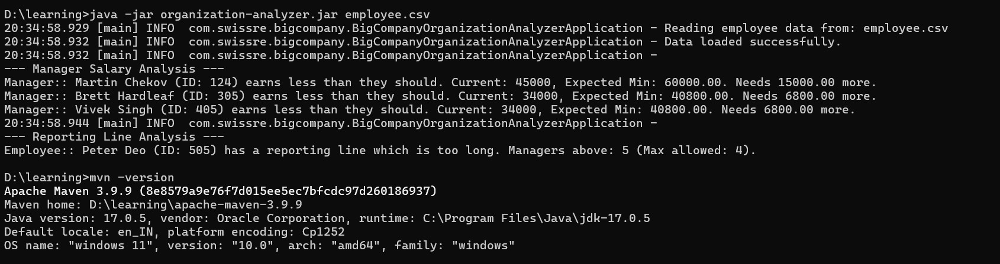

## Big Company Organization Analyzer
This application analyzes employee data from a CSV file to provide insights into an organization's 
structure and salaries. It's designed to help understand reporting lines and identify potential issues 
within the company's hierarchy and compensation.

### Features
##### CSV Data Ingestion: 
Reads employee information from a specified CSV file.
##### Salary Analysis:
Analyzes employee salaries to identify potential discrepancies or insights (specific analysis details depend on the OrganizationAnalyzer class implementation).
##### Reporting Line Analysis:
Examines the reporting structure to understand the organizational hierarchy (specific analysis details depend on the OrganizationAnalyzer class implementation).

####  Prerequisites
Java Development Kit (JDK) 17 or higher
Maven 3.9.9 (for building the project)

####  Step for execution
1) git clone <repository_url>
2) cd <repository_name>
3) mvn clean install
4) java -jar target/organization-analyzer.jar path-to-csv-file

#### Sample Program Output

--- Manager Salary Analysis --- 
Manager:: Martin Chekov (ID: 124) earns less than they should. Current: 45000, Expected Min: 60000.00. Needs 15000.00 more. 
Manager:: Vivek Singh (ID: 405) earns more than they should. Current: 24000, Expected Max: 21000.00. Needs 3000.00 less. 
--- Reporting Line Analysis --- 
Employee:: Peter Deo (ID: 505) has a reporting line which is too long. Managers above: 5 (Max allowed: 4).

##### Logging:
Provides informative logs for application flow and error handling using Log4j.  
Refer: organization-analyzer-${date:yyyyMMdd}.log in root directory
#### Error Handling
The application includes basic error handling for file reading and general exceptions. Any errors encountered will be logged to the console (or configured log destination).

#### Test Cases
1) Should correctly read CSV and build employee hierarchy.
2) Should throw IllegalArgumentException for invalid salary format.
3) Should detect managers earning more than they should.
4) Should detect employees with too long reporting lines
